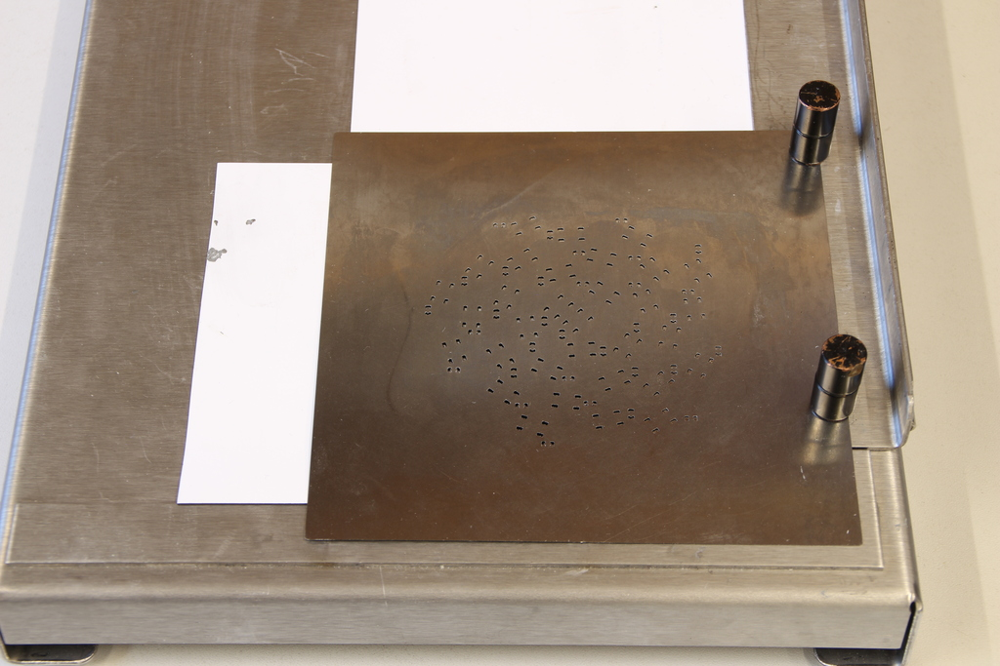
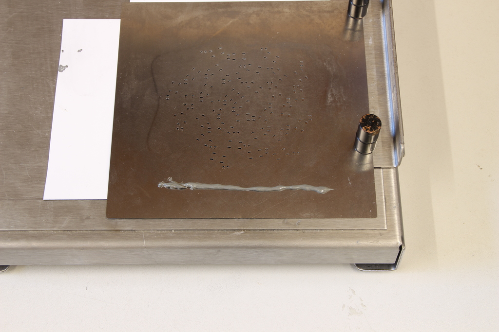
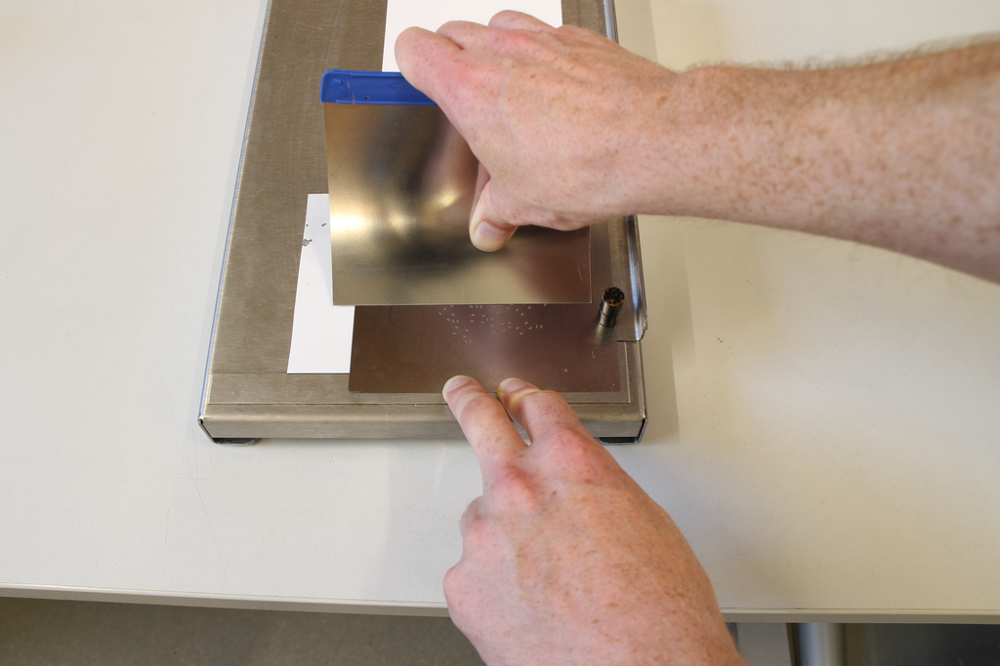
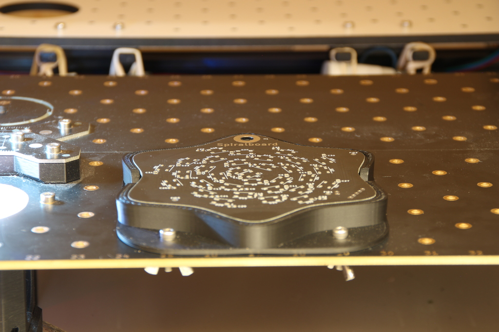
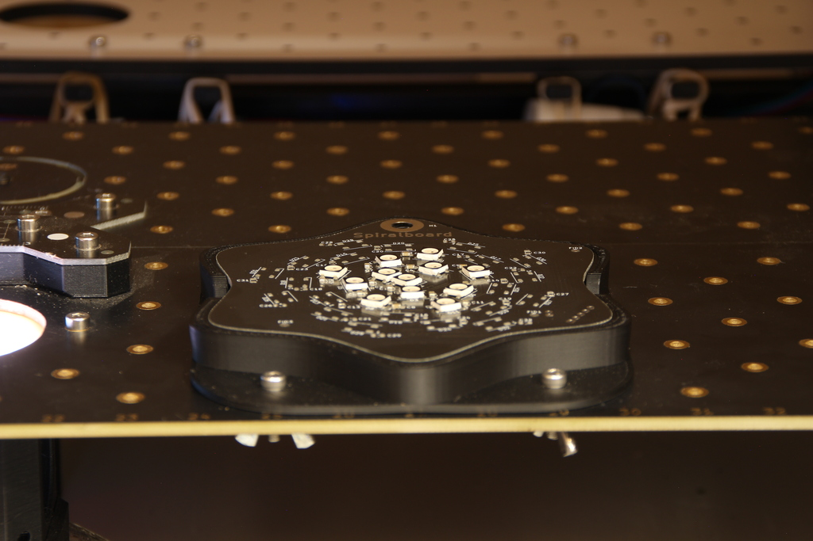
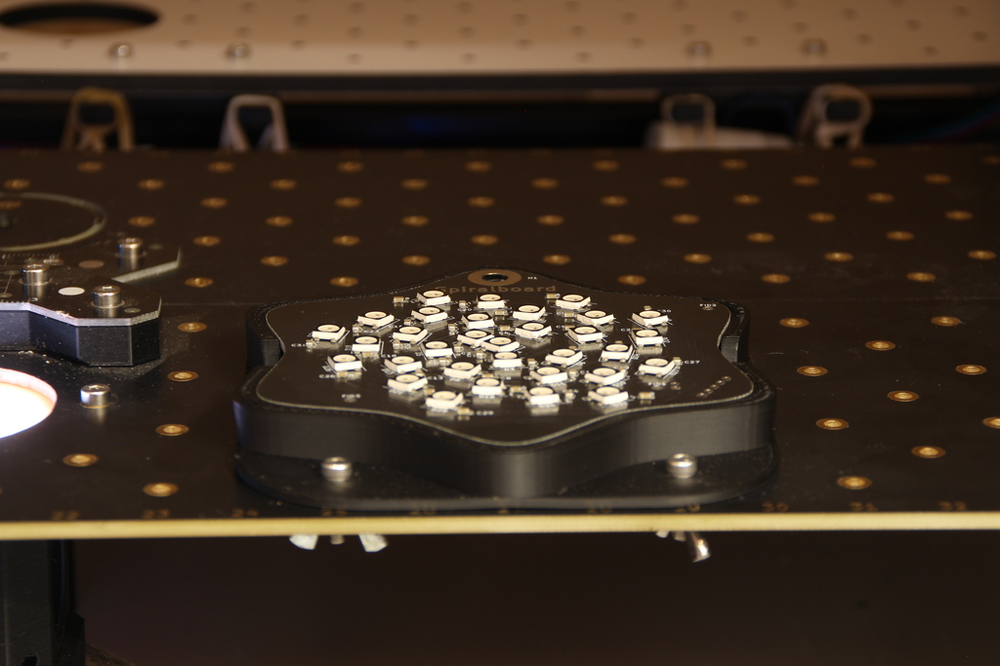
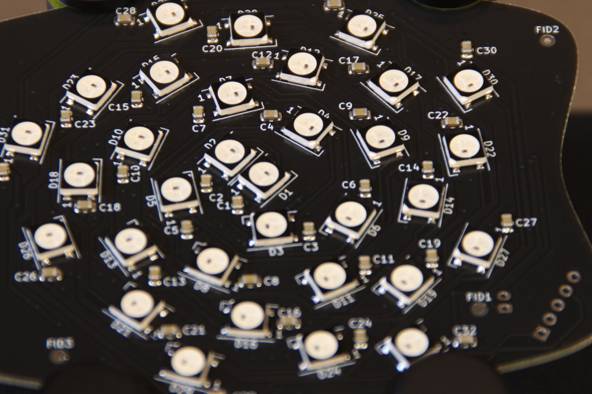

# Spiralboard - Lötanleitung

Einleitungsgeschwurbel mit schönem Bild

## Auftragen der Lötpaste

### Einlegen der Platine in den Schablonenhalter
Zu erst muss die Platine in den Schablonenhalter eingelegt werden, so dass die Platine rechts und unten an den Metallstegen anliegt. Die weißen Magnetplatten müssen so gegen die Platine geschoben werden, dass sie sich nicht mehr bewegen kann.

### Auflegen der Lötschablone
Nun muss die Lötschablone (oder auch Stencil) so auf die Platine aufgelegt werden, dass die Löcher in der Schablone und die silbernen Pads der Platine perfekt übereinander liegen.

Wenn alles perfekt passt, muss die Lötschablone mit den schwarzen Magneten am Scharnier des Schablonenhalters befestigt werden. Dabei muss darauf geachtet werden, dass die Schablone nicht wieder verrutscht. Das Scharnier beginnt erst ab ca. 2 cm von der unteren rechten Ecke. Die Magneten müssen also oberhalb platziert werden.

Achtung, die Magneten sind ziemlich stark.

### Auftragen der Lötpaste

Am unteren Rand der Lötschablone muss eine dünne Wurst aus Lötpaste aufgetragen werden. Die Wurst muss so breit sein, dass beim Rakeln alle Löcher in der Schablone gefüllt werden können.

Mit zwei Fingern wird die Lötschablone am unteren Rand fixiert und mit dem Rakel wird die Lötpaste über die Schablone gezogen. Dabei muss mit dem Daumen druck auf den Rakel ausgeübt werden, damit die Lötpaste sich gut in die Öffnungen setzen kann.

Zum Entfernen der Schablone wird mit dem rechten Daumen das Scharnier des Schablonenhalters blockiert und mit dem linken Zeigefinder die linke untere Ecke der Schablone angehoben. 

Hier muss darauf geachtet werden, dass die Schablone nicht zurückfällt, sonst kann die Lötpaste verschmiert werden.

Nachdem sich die Schablone komplett von der Platine gelöst hat, kann die Blockierung des Scharniers gelöst werden und das Scharnier mit der Schablone augeklappt werden.

Nun folgt die Kontrolle, ob die Lötpaste bündig auf den Pads aufgetragen ist. Ist dies nicht der Fall, muss die Platine gereinigt und der Vorgang wiederholt werden.

## Automatische Bestückung

Die Oberseite der Platine wird automatisch in der Pick and Place Maschine bestückt. Dazu muss die Platine in den dafür vorgesehenen Halter eingelegt werden.

Auf der Oberseite werden die LEDs und 100 nF Kondensatoren platziert.

## Backen der Platine

Die bestückte Platine muss jetzt im Lötofen gebacken werden.

Dazu wird die Platine vorsichtig mittig in den Ofen eingelegt, die Tür geschlossen, der Timer maximal aufgezogen und der Heizvorgang mit dem grünen Taster gestartet.

Auf dem Display kann der Temperaturverlauf verfolgt werden.

Nach beenden des Heizvorgangs verbleibt die Platine noch für 2-3 Minuten bei geschlossener Tür im Ofen (Egal was das Display sagt)

Anschließend wird die Tür für ca. 1 Minute einen Spalt breit geöffnet.

Daraufhin wird der Ofen komplett geöffnet und die heiße Platine mit einer Pinzette entnommen.

Zum schluss wird geprüft, ob alle Bauteile ordungsgemäß verlötet wurden.

## Handbestückung der Unterseite